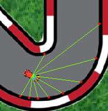

# Genetic algorithms with cars
This project aims to manipulate weights of several neural networks so that the AI is able to drive.  
I used Keras to create ANN and pygame to have a visual render of the execution of the program.   
There are 4 possible car behaviors on a given context: turn left, go straight, turn right, slow down.  
The speed is not limited and the acceleration is linear with a 1.4 factor.  
I achieved to make these AI drive fast without collision (for 10 laps in my tests), to be more specific they were able to make relevant decisions to reach the goal, the goal is to get as far as possible from the start position so they naturally learn to survive from collisions, they can also learn different trajectories optimization.  

## Approach
Generally with machine learning or more specifically with deep learning you do have ANNs and you train it passing input feature and it automatically compute and adjust weights/biases rather if it's supervised or not.  
With this approach I still have ANNs but there is not a single feed-forward/back propagation to manipulation and adjust the weights.  
I'm using genetic algorithms to create combinations of weights and biases over the generation based on the more relevant ANNs.  

The end-to-end implemented process related to AI process works as follow:
- Create a population of n=100 individuals, each individual correspond to a neural network
  - Let individuals make decision based on contextual data
  - Evaluation of individuals based on the distance they reach from the start
  - Selection of the top 15% of the population named parents
     - Keep 50% of the parents for next the generation (others will be transformed by mutation)
  - Crossover implies children from a pair of parent. For each weight, I'm simply taking a weight from parent 1 or from parent 2 with p=.5
  - Mutation is applied to every descendants with a mutation rate set as 0.01 and with different possibilities of random mutation
  - And so on

### Neural Networks
I decided to make a full model that include (100x) 'non-fully connected' sub models. This way I have a model with 100 independents Input layer which each correspond to a contextual data of a car.  
The goal of having a ful model is that I don't need to run 100x inferences at time but only once, so basically it's only for performance reasons, doing this way it's actually speeding up the process by a factor 20-50.  
There are 100 input layer, each of these layer are fully-connected to FNN composed of 128 perceptrons and then there is the output layer with a softmax to classify different outputs possibility.  
With this methodology I also need to be able to decompose the full model into respective weights and biases to make them correspond to the respective individuals and to be able to process genetic operators on them. 

There is a related work [here](https://github.com/swordey/Genetic2DCarGame) on which I was a little inspired but it's using 'fully-connected input layer' which actually simply mean a single input layer, however it's induces high biases for decision making because the brains of cars are analogically fully dependent from each other which apparently make no benefits (it's quite the opposite) in a genetic algorithm process.

### Input data
  
The context data is based on 9 distances harmonically defined with ahead vectors.  
For each car and for each step I calculate these distances and normalize them, then I can pass these value to the full model and get back the predictions.  

### Files :
It includes 5 main python files
1. `main.py`: This is the drivers code, using this file for the main program layout
2. `evolution.py`: Contains operators from GA process
3. `model.py`: Contains the implementation of ANN with Keras
4. `game.py`: Behaviors of the car and the game. Contains the gui manager.
5. `utils.py`

### Improvements
Try to optimize speed and trajectories as much as possible.

### Generations overview
NB. Generations |                                                             1→15                                                             |                                                            40→43                                                             |                                                            47→48                                                             | 65
:---: |:----------------------------------------------------------------------------------------------------------------------------:|:----------------------------------------------------------------------------------------------------------------------------:|:----------------------------------------------------------------------------------------------------------------------------:|:-------:
preview |  |  |  | 
